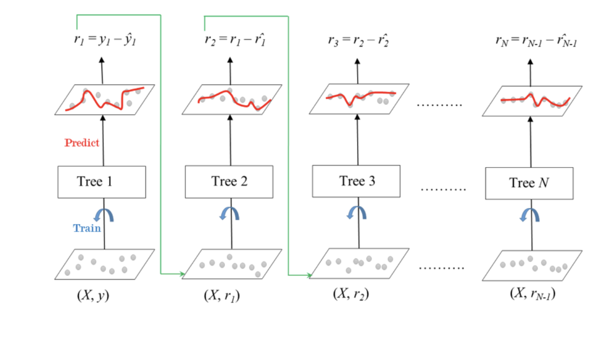

## AdaBoost (Adaptive boosting)

You learned about the concept of boosting in machine learning, focusing on AdaBoost (Adaptive Boosting) and its application. Boosting is an ensemble technique that combines multiple weak learners to form a strong learner, where each weak learner attempts to correct the errors of its predecessor. Specifically, you explored:

The definition of a weak learner, which is a model slightly better than random guessing, such as a decision tree with a maximum depth of one (decision stump).
How AdaBoost works by adjusting the weights of training instances based on the errors made by the previous predictor, and assigning a coefficient (alpha) to each predictor based on its error, influencing its contribution to the final prediction.
The importance of the learning rate (eta) in AdaBoost, which shrinks the coefficient alpha of each predictor to manage the trade-off between the learning rate and the number of estimators.



Classification: `AdaBoostClassifier`. It uses majority voting.
Regression: `AdaBoostRegressor`. It uses average 

```python 
# Imports
from sklearn.tree import DecisionTreeClassifier
from sklearn.ensemble import AdaBoostClassifier
from sklearn.metrics import roc_auc_score

# Instantiate dt
dt = DecisionTreeClassifier(max_depth=2, random_state=1)

# Instantiate ada
ada = AdaBoostClassifier(base_estimator=dt, n_estimators=180, random_state=1)

# Fit ada to the training set
ada.fit(X_train, y_train)

# Compute the probabilities of obtaining the positive class
y_pred_proba = ada.predict_proba(X_test)[:,1] 


# Evaluate test-set roc_auc_score
ada_roc_auc = roc_auc_score(y_test, y_pred_proba)

# Print roc_auc_score
print('ROC AUC score: {:.2f}'.format(ada_roc_auc))
```