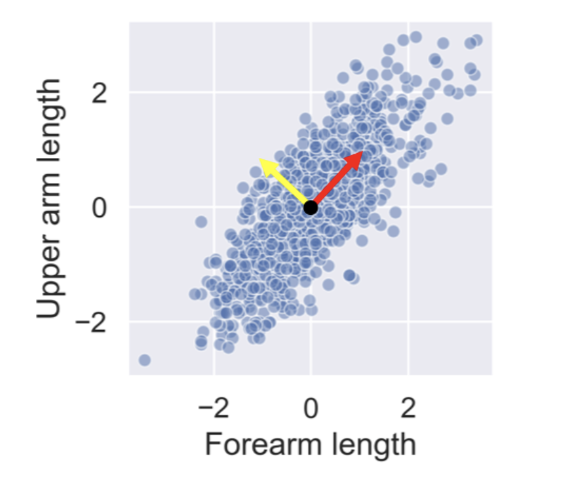

# Feature Reduction

New features as combination of original ones. 

## Strategies

* Knowledge of your dataset. It allows you to compose features into one in a way it makes sense for your data. Example combine height and weight in body mass index
```python
# Calculate the price from the quantity sold and revenue
sales_df['price'] = sales_df['revenue'] / sales_df['quantity']

# Drop the quantity and revenue features
reduced_df = sales_df.drop(["quantity", "revenue"], axis=1)

print(reduced_df.head())
```
* Take average of relative similar features. This implies some loss of information
```python 
# Calculate the mean height
height_df['height'] = height_df[["height_1", "height_2", "height_3"]].mean(axis=1)

# Drop the 3 original height features
reduced_df = height_df.drop(["height_1", "height_2", "height_3"], axis=1)

print(reduced_df.head())
```
* PCA  
After standardizing the lower and upper arm lengths from the ANSUR dataset we've added two perpendicular vectors that are aligned with the main directions of variance. We can describe each point in the dataset as a combination of these two vectors multiplied with a value each. These values are then called principal components.



Pca as part of its calculation get the variance explained in the data for each feature. This is so powerful for feature reduction.

```python
from sklearn.preprocessing import StandardScaler
from sklearn.decomposition import PCA

# Create the scaler
scaler = StandardScaler()
ansur_std = scaler.fit_transform(ansur_df)

# Create the PCA instance and fit and transform the data with pca
pca = PCA()
pc = pca.fit_transform(ansur_std)
pc_df = pd.DataFrame(pc, columns=['PC 1', 'PC 2', 'PC 3', 'PC 4'])

# Create a pairplot of the principal component DataFrame
sns.pairplot(pc_df)
plt.show()S

pca.fit(ansur_std)

print(pca.explained_variance_ratio_)
print(pca.explained_variance_ratio_.cumsum())
```

n_components could use a value between 0 and 1 to decide how much variance do you want to keep


#Determine how much features to keep
 You can use the elbow plot to determine when the features stop adding information

 ```python 
# Pipeline a scaler and pca selecting 10 components
pipe = Pipeline([('scaler', StandardScaler()),
        		 ('reducer', PCA(n_components=10))])

# Fit the pipe to the data
pipe.fit(ansur_df)

# Plot the explained variance ratio
plt.plot(pipe['reducer'].explained_variance_ratio_)

plt.xlabel('Principal component index')
plt.ylabel('Explained variance ratio')
plt.show()
 ```


## Using for image reduction 

```python
# Transform the input data to principal components
pc = pipe.transform(X_test)

# Prints the number of features per dataset
print(f"X_test has {X_test.shape[1]} features")
print(f"pc has {pc.shape[1]} features")

# Transform the input data to principal components
pc = pipe.transform(X_test)

# Inverse transform the components to original feature space
X_rebuilt = pipe.inverse_transform(pc)

plot_digits(X_rebuilt)
```

