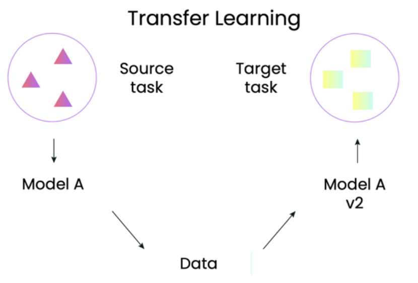

# Hugging Face

Hugging Face is an open-source collaboration platform that serves as a hub for machine learning resources. It provides:

- Pre-trained models for text, vision, and audio processing
- Datasets for various machine learning tasks
- Tools and frameworks for model training, fine-tuning, and deployment
- Community-driven development and sharing of AI resources

The platform enables researchers, developers, and organizations to easily share, discover, and utilize state-of-the-art machine learning technologies.

## Large Language Models (LLMs)

Hugging Face offers a diverse range of pre-trained language models based on transformer architectures. These models can be used for tasks such as:

- Text generation
- Text classification
- Question answering
- Summarization
- Translation
- Named entity recognition

| Use Cases for Hugging Face | When to Use Other Solutions |
|----------------------------|----------------------------|
| Quick implementation of ML tasks | Limited computational resources |
| Projects without deep ML expertise | Need for highly customized architectures |
| Testing and comparing multiple models | Very specific domain requirements |
| Need for ready-to-use datasets | Cases not benefiting from advanced ML techniques |
| Rapid prototyping | Projects requiring full control over implementation details |

## Transformers

Transformers are a type of neural network architecture that has revolutionized natural language processing and other domains. They excel at understanding context and relationships within sequential data.

Core components:
* **Encoder**: Processes the input sequence and creates contextual representations
* **Decoder**: Generates outputs based on encoder representations and previously generated tokens
* **Self-attention mechanism**: Allows the model to weigh the importance of different parts of the input when making predictions

The key innovation of transformers is their ability to process all parts of the input simultaneously while maintaining awareness of relative positions, making them highly effective for parallel processing.

## Transfer Learning

Transfer learning allows existing pre-trained models to be fine-tuned for specific tasks with relatively small amounts of task-specific data. This approach:

1. Starts with a model pre-trained on a large general corpus
2. Fine-tunes the model on domain-specific data
3. Benefits from the general knowledge encoded in the pre-trained weights



This dramatically reduces the computational resources and data required to achieve strong performance on specialized tasks.

## Hugging Face API

The Hugging Face API provides programmatic access to the platform's resources:

```python 
# Import necessary modules
from huggingface_hub import HfApi, ModelFilter

# Create the instance of the API
api = HfApi()

# Return the filtered list from the Hub
models = api.list_models(
    filter=ModelFilter(task="text-classification"),
    sort="downloads",
    direction=-1,
    limit=1
)

# Store as a list
modelList = list(models)

print(modelList[0].modelId)
```

## Saving Models Locally

Models can be downloaded and saved locally for offline use or deployment:

```python 
# Import the required libraries
from transformers import AutoModel

modelId = "distilbert-base-uncased-finetuned-sst-2-english"

# Instantiate the AutoModel class
model = AutoModel.from_pretrained(modelId)

# Save the model
model.save_pretrained(save_directory=f"models/{modelId}")
```

## Working with Datasets

Hugging Face provides a powerful datasets library for accessing and manipulating datasets:

```python 
# Load the module
from datasets import load_dataset_builder

# Create the dataset builder
dataset_builder = load_dataset_builder("wikidata_extract")

# Extract the features
dataset_description = dataset_builder.info.description
dataset_features = dataset_builder.info.features
```

Loading specific datasets:

```python 
# Import the dataset module
from datasets import load_dataset

# Load the train portion of the dataset
wikipedia = load_dataset("wikimedia/wikipedia", language="20231101.en", split="train")
```

Filtering and manipulating datasets:

```python 
# Filter the documents
filtered = wikipedia.filter(lambda row: "football" in row["text"])

# Create a sample dataset
example = filtered.select(range(1))

print(example[0]["text"])
```

## Model Inference

Using models for inference tasks:

```python
# Import necessary libraries
from transformers import pipeline

# Create a text classification pipeline
classifier = pipeline("sentiment-analysis")

# Run inference
result = classifier("I love using Hugging Face transformers!")
print(result)
# Output: [{'label': 'POSITIVE', 'score': 0.999817686}]
```