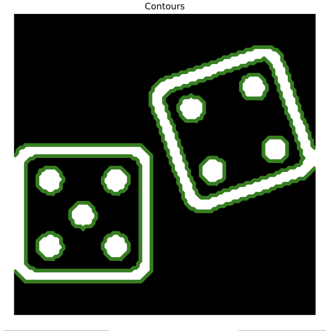

# Restoration

Inpainting: Restore lost parts of images


```python 
# Initialize the mask
mask = np.zeros(image_with_logo.shape[:-1])

# Set the pixels where the logo is to 1
mask[210:290, 360:425] = 1

# Apply inpainting to remove the logo
image_logo_removed = inpaint.inpaint_biharmonic(image_with_logo,
                                  mask,
                                  multichannel=True)

# Show the original and logo removed images
show_image(image_with_logo, 'Image with logo')
show_image(image_logo_removed, 'Image with logo removed')
```

# Noise

It's generated by errors in pixels acquisition process.

You can add noise or remove noise using skimage

```python 
# Import the module and function
from skimage.util import random_noise

# Add noise to the image
noisy_image = random_noise(fruit_image)

# Show original and resulting image
show_image(fruit_image, 'Original')
show_image(noisy_image, 'Noisy image')
```

## Denoising algorithms

### Total variation filter

This method reduces noise by minimizing the total variation of the image, leading to smoother, sometimes "cartoon-like" images.

```python 
# Import the module and function
from skimage.restoration import denoise_tv_chambolle

# Apply total variation filter denoising
denoised_image = denoise_tv_chambolle(noisy_image, 
                                      multichannel=True)

# Show the noisy and denoised images
show_image(noisy_image, 'Noisy')
show_image(denoised_image, 'Denoised image')
```
### Bilateral filtering

Focuses on smoothing images while preserving edges, by replacing the intensity of each pixel with a weighted average from nearby pixel

```python 
# Import bilateral denoising function
from skimage.restoration import denoise_bilateral

# Apply bilateral filter denoising
denoised_image = denoise_bilateral(landscape_image, 
                                   multichannel=True)

# Show original and resulting images
show_image(landscape_image, 'Noisy image')
show_image(denoised_image, 'Denoised image')
```
* Wavelet
* Non local means

# Superpixels and segmentation 

Segmentation: separate an image in regions to get something meaningful 

Superpixel: Group of pixels with similar colors or grey scale
Supervised: with prior knowledge
Unsupervised: Without prior knowledge

## Simple linear iterative clustering ()slic

```python 
# Import the slic function from segmentation module
from skimage.segmentation import slic

# Import the label2rgb function from color module
from skimage.color import label2rgb

# Obtain the segmentation with 400 regions
segments = slic(face_image, n_segments=400)

# Put segments on top of original image to compare
segmented_image = label2rgb(segments, face_image, kind='avg')

# Show the segmented image
show_image(segmented_image, "Segmented image, 400 superpixels")
```

# Contours

it allows: 
* Minimize size
* Classify shapes
* Determine number of objects

You need a binary image. You can get it applying thresholding or edge detection.


```python 
# Import the modules
from skimage import filters, color, measure

# Make the image grayscale
image_dice = color.rgb2gray(image_dice)

# Obtain the optimal thresh value
thresh = filters.threshold_otsu(image_dice)

# Apply thresholding
binary = image_dice > thresh

# Find contours at a constant value of 0.8
contours = measure.find_contours(binary, 0.8)

# Show the image
show_image_contour(image_dice, contours)
```
The second constant parameter allows to detect more complex contours as it grows

## counting elements



```python 
# Set 50 as the maximum size of the dots shape
max_dots_shape = 50

# Count dots in contours excluding bigger than dots size
dots_contours = [cnt for cnt in contours if np.shape(cnt)[0] < max_dots_shape]

# Print the dice's number
print("Dice's dots number: {}. ".format(len(dots_contours)))
```

```shell
Dice's dots number: 9. 
```