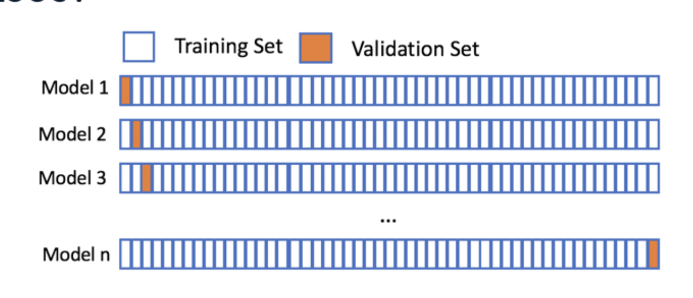

# Model validation

Validate behavior is the expected. Best performance possible

Decisions to be made:

* Model
* parameters
* accuracy metric

# Hold out set

Divide train set into actual train set and validation test. This is used just for validation tasks 


# Metrics

## Regression

### MAE mean absolute error

* Simple 
* Treats all points equally
* Not sensitive to outliers

```python 
from sklearn.metrics import mean_absolute_error

# Manually calculate the MAE
n = len(predictions)
mae_one = sum(np.abs(y_test - predictions)) / n
print('With a manual calculation, the error is {}'.format(mae_one))

# Use scikit-learn to calculate the MAE
mae_two = mean_absolute_error(y_test, predictions)
print('Using scikit-learn, the error is {}'.format(mae_two))
```

### Mean squared error (MSE)

* Widely used
* Allows outlier error to contribute more to the overall error
* 

```python 
from sklearn.metrics import mean_squared_error as MSE

n = len(predictions)
# Finish the manual calculation of the MSE
mse_one = sum((y_test - predictions)**2) / n
print('With a manual calculation, the error is {}'.format(mse_one))

# Use the scikit-learn function to calculate MSE
mse_two = MSE(y_test, predictions)
print('Using scikit-learn, the error is {}'.format(mse_two))
```

### filter by a group

```python 
# Find the East conference teams
east_teams = labels == "E"

# Create arrays for the true and predicted values
true_east = y_test[east_teams]
preds_east = predictions[east_teams]

# Print the accuracy metrics
print('The MAE for East teams is {}'.format(
    mae(true_east, preds_east)))

# Print the West accuracy
print('The MAE for West conference is {}'.format(west_error))
```

## Classification

### Confusion matrix

Combination of true false, positive negative values

```python 
from sklearn.metrics import confusion_matrix

# Create predictions
test_predictions = rfc.predict(X_test)

# Create and print the confusion matrix
cm = confusion_matrix(y_test, test_predictions)
print(cm)

# Print the true positives (actual 1s that were predicted 1s)
print("The number of true positives is: {}".format(cm[1, 1]))
```

### Accuracy

All true values / total 

I want to ensure the model predict both cases correctly

### Precision

True positives /  al predicted positives 

If I predict positive I want to ensure that is actually positive

### Recall 

true positives /  all actual positive

I want to ensure that I predicted positive correctly

# H0ld out samples issues

## Difference between samples

```python
# Create two different samples of 200 observations 
sample1 = tic_tac_toe.sample(200, random_state=1111)
sample2 = tic_tac_toe.sample(200, random_state=1171)

# Print the number of common observations 
print(len([index for index in sample1.index if index in sample2.index]))

# Print the number of observations in the Class column for both samples 
print(sample1['Class'].value_counts())
print(sample2['Class'].value_counts())
```
## Cross validation

it addresses previous issues

### KFold

```python 
from sklearn.ensemble import RandomForestRegressor
from sklearn.metrics import mean_squared_error

rfc = RandomForestRegressor(n_estimators=25, random_state=1111)

# Access the training and validation indices of splits
for train_index, val_index in splits:
    # Setup the training and validation data
    X_train, y_train = X[train_index], y[train_index]
    X_val, y_val = X[val_index], y[val_index]
    # Fit the random forest model
    rfc.fit(X_train, y_train)
    # Make predictions, and print the accuracy
    predictions = rfc.predict(X_val)
    print("Split accuracy: " + str(mean_squared_error(y_val, predictions)))
```

### cross_val_score


```python 
# Instruction 1: Load the cross-validation method
from sklearn.model_selection import cross_val_score

# Instruction 2: Load the random forest regression model
from sklearn.ensemble import RandomForestRegressor

# Instruction 3: Load the mean squared error method
# Instruction 4: Load the function for creating a scorer
from sklearn.metrics import mean_squared_error, make_scorer

rfc = RandomForestRegressor(n_estimators=25, random_state=1111)
mse = make_scorer(mean_squared_error)

# Set up cross_val_score
cv = cross_val_score(estimator=rfc,
                     X=X_train,
                     y=y_train,
                     cv=10,
                     scoring=mse)

# Print the mean error
print(cv.mean())
```

### Leave one out cross validation 



Usage:
* Limited data
* you need the absolute best error estimate for new data

Drawbacks:
* computational expensive

```python 
from sklearn.metrics import mean_absolute_error, make_scorer

# Create scorer
mae_scorer = make_scorer(mean_absolute_error)

rfr = RandomForestRegressor(n_estimators=15, random_state=1111)

# Implement LOOCV
scores = cross_val_score(rfr, X=X, y=y, cv=X.shape[0], scoring=mae_scorer)

# Print the mean and standard deviation
print("The mean of the errors is: %s." % np.mean(scores))
print("The standard deviation of the errors is: %s." % np.std(scores))
```

# Hyper parameter tunning


## Random searching

```python 
from sklearn.ensemble import RandomForestRegressor
from sklearn.metrics import make_scorer, mean_squared_error

# Finish the dictionary by adding the max_depth parameter
param_dist = {"max_depth": [2, 4, 6, 8],
              "max_features": [2, 4, 6, 8, 10],
              "min_samples_split": [2, 4, 8, 16]}

# Create a random forest regression model
rfr = RandomForestRegressor(n_estimators=10, random_state=1111)

# Create a scorer to use (use the mean squared error)
scorer = make_scorer(mean_squared_error)

# Import the method for random search
from sklearn.model_selection import RandomizedSearchCV

# Build a random search using param_dist, rfr, and scorer
random_search =\
    RandomizedSearchCV(
        estimator=rfr,
        param_distributions=param_dist,
        n_iter=10,
        cv=5,
        scoring=scorer)
```
 