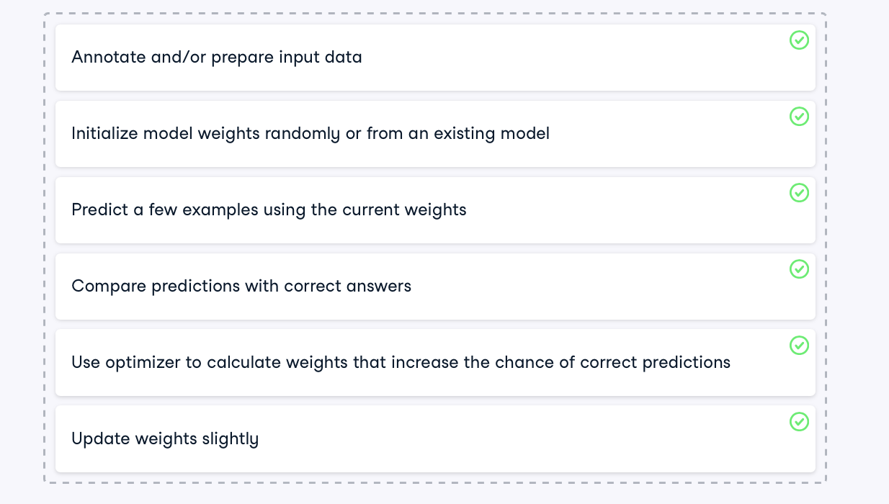

# Customization

When a model performs bad to our use case or we have a very specific domain we should extend an existing model or train one from scratch. 



## Prepare training data

Annotate data with the format needed by Spacy

```python 
text = "A patient with chest pain had hyperthyroidism."
entity_1 = "chest pain"
entity_2 = "hyperthyroidism"

# Store annotated data information in the correct format
annotated_data = {"sentence": text, "entities": [{"label": "SYMPTOM", "value": entity_1}, {"label": "DISEASE", "value": entity_2}]}

# Extract start and end characters of each entity
entity_1_start_char = text.find(entity_1)
entity_1_end_char = entity_1_start_char + len(entity_1)
entity_2_start_char = text.find(entity_2)
entity_2_end_char = entity_2_start_char + len(entity_2)

# Store the same input information in the proper format for training
training_data = [(text, {"entities": [(entity_1_start_char,entity_1_end_char,"SYMPTOM"), 
                                      (entity_2_start_char,entity_2_end_char,"DISEASE")]})]
print(training_data)
```

You need to create one Example object for each training example as follows

```python 
example_text = 'A patient with chest pain had hyperthyroidism.'
training_data = [(example_text, {'entities': [(15, 25, 'SYMPTOM'), (30, 45, 'DISEASE')]})]

all_examples = []
# Iterate through text and annotations and convert text to a Doc container
for text, annotations in training_data:
  doc = nlp(text)
  
  # Create an Example object from the doc contianer and annotations
  example_sentence = Example.from_dict(doc, annotations)
  print(example_sentence.to_dict(), "\n")
  
  # Append the Example object to the list of all examples
  all_examples.append(example_sentence)
  
print("Number of formatted training data: ", len(all_examples))
```

## Train 

1- Disable other pipeline components other the one we 'd like to train 

```python 
nlp = spacy.load("en_core_web_sm")

# Disable all pipeline components of  except `ner`
other_pipes = [p for p in nlp.pipe_names if p != 'ner']
nlp.disable_pipes(*other_pipes)
```

2 - Convert data to proper format for training

```python 
# Convert a text and its annotations to the correct format usable for training
doc = nlp.make_doc(text)
example = Example.from_dict(doc, annotations)
```

2 - Convert data to proper format for training

```python 
optimizer = nlp.create_optimizer()

# Shuffle training data and the dataset using random package per epoch
for i in range(epochs):
  random.shuffle(training_data)
  for text, annotations in training_data:
    doc = nlp.make_doc(text)
    # Update nlp model after setting sgd argument to optimizer
    example = Example.from_dict(doc, annotations)
    nlp.update([example], sgd = optimizer)
print("After training: ", [(ent.text, ent.label_) for ent in nlp(test).ents])
```

3 SAve the model

```python 
```

$ load a model 

```python 
```
